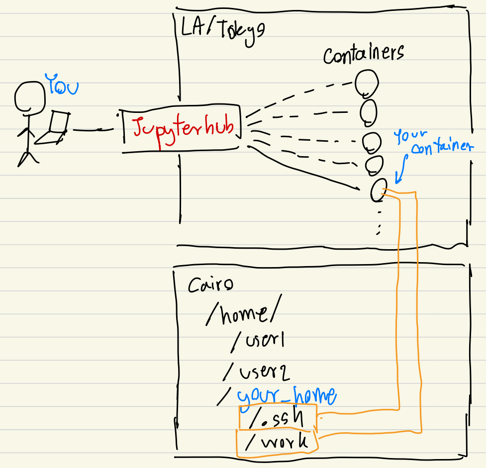
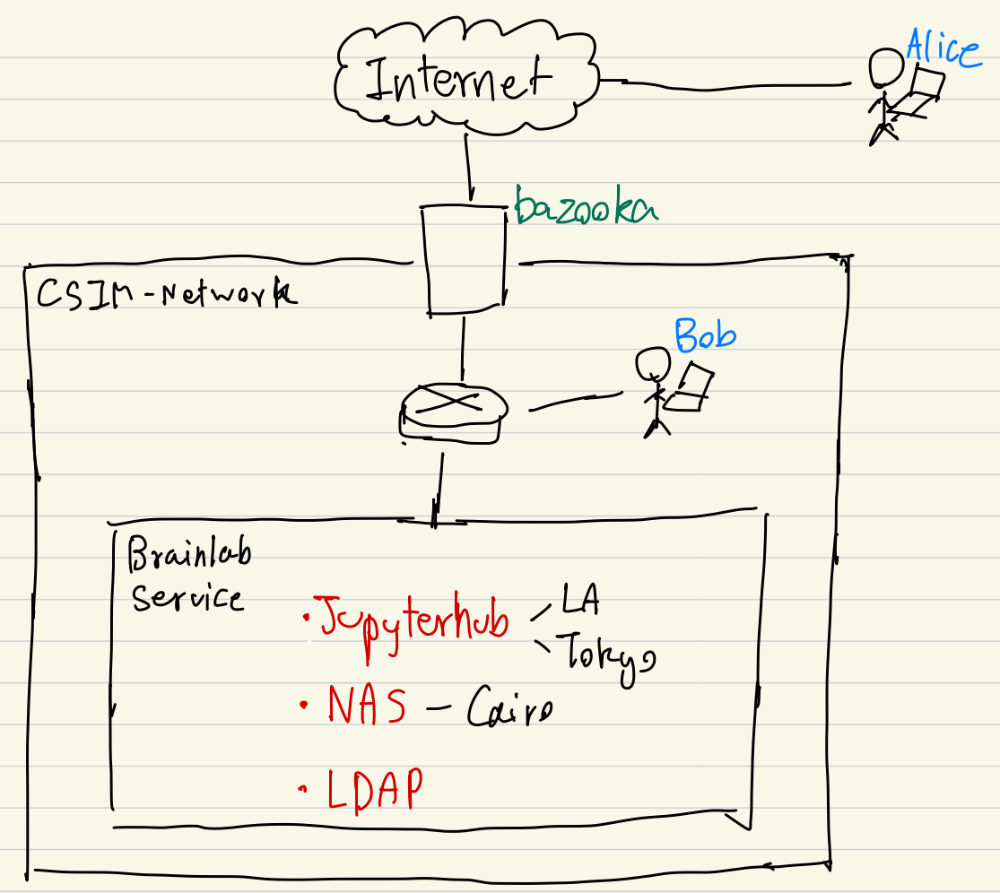

This Repository store knowledge, step, guide, and reference of AIT Brainlab Jupyterhub implementation.

Our current implementation (as of this commit) uses `Jupyterhub` with `dockerspawner` to spawner Docker container. The authentication is done with the `openLDAP`. And, user's work is stored via `NAS`.

This document is for those who want to use the system (user). Please read [README_admin.md](README_admin.md) if you want to replicate this work (admin).

- [Topology](#topology)
- [For Jupyterhub User](#for-jupyterhub-user)
- [Eligibility](#eligibility)
- [Get a credential](#get-a-credential)
- [The first thing to do once the credential is received](#the-first-thing-to-do-once-the-credential-is-received)
- [Accessing Jupyterhub](#accessing-jupyterhub)
- [SSH to servers](#ssh-to-servers)
  - [Bob's case (intranet)](#bobs-case-intranet)
  - [Alice's case (Internet)](#alices-case-internet)
- [SSH to containers](#ssh-to-containers)
- [Passwordless SSH to Servers/Containers](#passwordless-ssh-to-serverscontainers)
  - [1. Create a public/private key](#1-create-a-publicprivate-key)
  - [2. Give the public key to the server](#2-give-the-public-key-to-the-server)
  - [3. SSH to the server with the private key authentication option](#3-ssh-to-the-server-with-the-private-key-authentication-option)
  - [4. (optional) Create `config` in `/.ssh` of your machine. So you don't have to remember the long command.](#4-optional-create-config-in-ssh-of-your-machine-so-you-dont-have-to-remember-the-long-command)
- [Customizing Docker image](#customizing-docker-image)

# Topology
  
As mentioned above, the current implementation of `Jupyterhub` uses `dockerspawner` to create a container for each user, uses `NAS` to store the user's `home` where `/.ssh` and `/work` are mapped to the container, and uses `LDAP` for authorization and provisioning.

The topology below is a typical view of `jupyter` users.



When a user accesses the service, `Jupyterhub` will handle the preliminary procedure, which is authentication and container creation. At authentication, users provide their a credential (username and password) which `Jupyterhub` will validate with the `LDAP`. If the credential is correct, `LDAP` returns the user's information needed for container creation. The list of available docker images is shown. The container creation spawns a container base on the selected image, map `/.ssh`, `/work` from the user's `home` directory which is provided from `NAS` (We choose not to map `~` to prevent conflict from different kernels), and map SSH port (provisioning from `LDAP`). Once the container is spawned, `Jupyterhub` sends users a cookie for accessing the container. Thus, the user is no longer needed to contact `Jupyterhub`

This implementation provides the benefits we are seeking for.
1. It encourages experimenting with libraries.
2. Each user is isolated from the other.
3. We can give them `sudo` privilege under their container.
4. Works are stored in `NAS`. Thus, `Jupyter` service has redundancy. 

# For Jupyterhub User

# Eligibility

If you are a member of AIT Brainlab, you are eligible.

# Get a credential

Please contact the system admin for a credential.

# The first thing to do once the credential is received

You should SSH to `Cairo` (Read [SSH to servers](#ssh-to-servers)). By login to `Cairo`, the system creates your `home` directory. Then, you should create your `/work` and `/.ssh` now.

```sh
mkdir ~/work
mkdir ~/.ssh
chmod 700 ~/.ssh
```

(If you miss this step, these folders will be created by `root` during container creation. Thus, these folders will be owned by `root` not you.)

While you are here, you should reset your password too.

```sh
passwd
```

# Accessing Jupyterhub

`Jupyterhub` is served in both [`LA`](https://la.cs.ait.ac.th) and  [`Tokyo`](https://tokyo.cs.ait.ac.th). 


# SSH to servers

> **Basic Networking**
>
> There are various terms we used for referencing which network we are talking about. *Internet* is the term we use for referencing the outside/global/public network where the services such as `Google`, `Facebook`, `Youtube`, `TikTok` are served. *Intranet* is for referencing inside/local/private network. For example, dorm network, home network, and CSIM network are considered to be private network. Thus, they are intranet. **In general, the service from the intranet can not be accessed from the internet**
>
> Our CSIM network IP is [`192.41.170.0`](https://en.ipshu.com/ip_d_list/192.41.170) which is a public IP range. Then why do we say CSIM network is private. This is because we have a firewall in between CSIM network and the internet. Thus, there is a control who can access what. `Puffer`, `LA`, and `Tokyo` can be accessed from the internet because the firewall allowed any `http` (80) and `https` (443) to go through.



There are two scenarios. From the image above, we have `Alice` and `Bob`. `Alice` is outside of the CSIM building, hence `Alice` is accessing the CSIM network through the internet. `Bob` works at the CSIM building, hence `Bob` accessing the services within the intranet.

## Bob's case (intranet)

Since there is no firewall in the intranet, `Bob` can `SSH` to any servers directly. Here is the command.

```sh
ssh <username>@<server_name>
```

You replace `<username>` with the username provided by our lab and replace the `<server_name>` with the server's name.

server's names are
- la.cs.ait.ac.th
- tokyo.cs.ait.ac.th
- cairo.cs.ait.ac.th

> **Fun fact**
>
> When you are in the CSIM network, you can use alias name instead of full server name. For instance, you can use `la` instead of `la.cs.ait.ac.th`.

## Alice's case (Internet)

Unlike `Bob`, `Alice` can not access servers directly. The only way `Alice` can access the server is through the `bazooka` server. Essentially, `Alice` has to SSH to the `bazooka` first, then SSH to other servers.

```sh
ssh <stid>@bazooka.cs.ait.ac.th
# Login with CSIM account
ssh <username>@<serve_rname>
# Login with Brainlab Account
```

If you hate to type the command twice, you can use `Proxy` option. [ref](https://www.cyberciti.biz/faq/linux-unix-ssh-proxycommand-passing-through-one-host-gateway-server/)

```sh
# ProxyJump
ssh -J <stid>@bazooka.cs.ait.ac.th <username>@<serve_rname>
# Login with CSIM account
# Login with Brainlab Account
```

```sh
# ProxyCommand
ssh -o ProxyCommand="ssh -W %h:%p <stid>@bazooka.cs.ait.ac.th"  <username>@<serve_rname>
# Login with CSIM account
# Login with Brainlab Account
```

```sh
# -tt option
ssh -tt <stid>@bazooka.cs.ait.ac.th ssh -tt <username>@<serve_rname>
# Login with CSIM account
# Login with Brainlab Account
```

If you hate to type a password, you have to use public/private key authentication.

# SSH to containers

You have to read [SSH to servers](#ssh-to-servers) first.

Let's assume that you have spawned your container in `Tokyo`. At this point, the container SSH port is the last 5 digits of your student id. For instance, if the student id is st123456, the SSH port is `23456`. In addition, other students are also working in `Tokyo` too. Their student is might be st120001 and st120002 so the ports are `20001` and `20002`.

At this point, the `Tokyo` SSH ports are the following
- 22 (default) - SSH to `Tokyo`
- 20001 (student A) - SSH to the container of student A
- 20002 (student B) - SSH to the container of student A
- 23456 (you) - SSH to your container

Therefore, you have to specify a port number when you are SSH to `Tokyo` otherwise the default `22` is used (which you will end up in `Tokyo` server instead).

However, there is no password inside the container (when you use `sudo`, it just runs without asking for a password). Thus, the only way to SSH to containers is you need to do public/private key authentication.

# Passwordless SSH to Servers/Containers

I trick you to read a bunch of text. Actually, this is all you need to SSH to servers or containers. However, the knowledge won't go to waste. 

These are the steps to do
1. Create a public/private key.
2. Give the public key to the server.
3. SSH to the server with the private key authentication option
4. (optional) Create `config` in `/.ssh` of your machine. So you don't have to remember the long command.

##  1. Create a public/private key 

[ref](https://docs.github.com/en/authentication/connecting-to-github-with-ssh/generating-a-new-ssh-key-and-adding-it-to-the-ssh-agent)

1. Open `cmd`, `PowerShell`, or `terminal`
2. Issue `ssh-keygen` command.
```
ssh-keygen -t rsa -b 4096 -C "<label>" -f "<path/to/save/file/keyname>"
```
- `<label>`: This will be added at the end of your public key
- `<path/to/save/file/keyname>`: Provide a full path of your output file. For instance, if you want the file to be saved in your `home` directory, inside `.ssh` folder, and name the file `my_key`, you put `~/.ssh/my_key`
3. You will be prompted with 
```
Generating public/private rsa key pair.
Enter passphrase (empty for no passphrase):
Enter same passphrase again:
```
This is the passphrase (or password) of your `private key`. Every time you use the key, you have to specify the passphrase. If you hate to type a passphrase, you have two options.
(1) Don't use a passphrase. Anyone with your private key can just use it.
(2) Cache the passphrase with SSH-Agent. You will only type the passphrase once for one terminal session. [ref](https://askubuntu.com/questions/362280/enter-ssh-passphrase-once).

4. If the generation is successful, there will be a bunch of text printing. Your public key and private key should be in `path/to/save/file/keyname` (private key) and `path/to/save/file/keyname.pub` (public key)

We treat keys like passwords. If you are lazy, you use one pair (public/private) for all servers. If you are secured, you create one pair for one server.

## 2. Give the public key to the server

Let's set the `bazooka` first.

1. Copy your public key to `bazooka`
```sh
scp path/to/save/file/keyname.pub <stid>@bazooka.cs.ait.ac.th:~
```
2. SSH to `bazooka`
3. Check if you have `.ssh` folder yet. If not, create one.
```sh
mkdir ~/.ssh
chmod 700 ~/.ssh
```
4. Create `authorized_keys` in `.ssh` folder. Of cause, only if you don't have one.
```sh
touch ~/.ssh/authorized_keys
chmod 600 ~/.ssh/authorized_keys
```
5. Copy the content of your public key to `authorized_keys`
```sh
cat ~/keyname.pub >> ~/.ssh/authorized_keys
```
6. You can delete the public key or leave it. Up to you.
```sh
# To delete public key
rm ~/keyname.pub
```

## 3. SSH to the server with the private key authentication option

Go back to your machine. (If you are still SSH in `bazooka` use `exit` to leave the session)

From your machine, use `-i` to use public/private key authentication.
```
ssh -i path/to/save/file/keyname <stid>@bazooka.cs.ait.ac.th
```

You should just SSH to `bazooka` without using the CSIM password.

## 4. (optional) Create `config` in `/.ssh` of your machine. So you don't have to remember the long command.

Now, we will create a `config` file for the ultimate convenience (because we are too lazy to type).

1. create `config` file in your `~/.ssh`.
```sh
# For MacOS and Linux
touch ~/.ssh/config
# For Windows user. Open the folder and create the file yourself.
explorer C:\Users\<PC_username>\.ssh
```
2. Edit the `config` with the following configuration. [ref](https://www.howtogeek.com/devops/how-to-manage-an-ssh-config-file-in-windows-linux/)
```
Host bazooka
  HostName bazooka.cs.ait.ac.th
  Port 22
  User <student_id>
	IdentityFile <path/to/save/file/keyname>
	IdentitiesOnly yes
```
Save the file.
3. Try to SSH with the new nickname
```sh
ssh bazooka
```

-----

Now, let's discuss how can you SSH to your containers.
Since our lab uses `NAS` and your container map `.ssh` from your `home` into its, your `.ssh` is shared in all Brainlab servers including the container. Thus, all you need to do is to make sure you can use your private key to SSH to `Cairo`. Then, with the same private key, you can SSH to any of the Brainlab servers and containers.

1. SSH to `Cairo`
2. Create `authorzied_keys` inside the `.ssh` folder.
3. Copy your public key to the `authorzied_keys`.
4. Try SSH to `Cairo` again. This should work first.
5. Add the config so we don't need to remember the long command
```
Host cairo
  HostName cairo.cs.ait.ac.th
  ProxyJump bazooka
  User <brainlab_username>
  Port 22
  ForwardAgent yes
  IdentitiesOnly yes
  IdentityFile <path/to/save/file/keyname>
  ServerAliveInterval 60
```
6. Try SSH with the nickname.
```sh
ssh cairo
```
7. To do this for a container in `LA`, add this to `~/.ssh/config`.
```
Host la_container
  HostName la.cs.ait.ac.th
  ProxyJump bazooka
  User <brainlab_username>
  Port <Container SSH port>
  ForwardAgent yes
  IdentitiesOnly yes
  IdentityFile <path/to/save/file/keyname>
  ServerAliveInterval 60
```
If you don't know your Container SSH port, read [SSH to Containers](#ssh-to-containers)
1. Start a container inside the `LA` server.
2. Try SSH to the container.
```sh
ssh la_container
```

Enjoy Developing!!

# Customizing Docker image

[TODO]